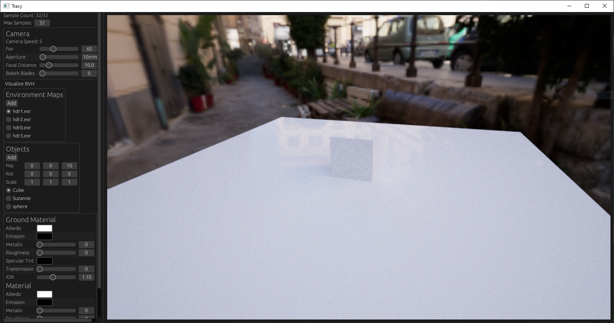
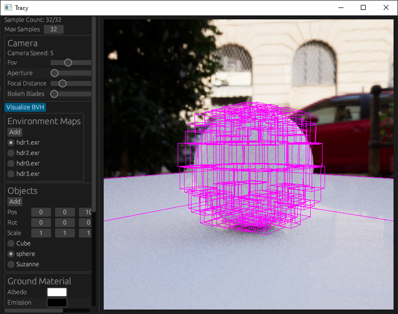
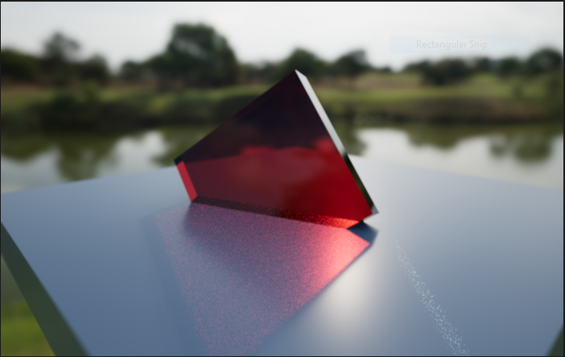
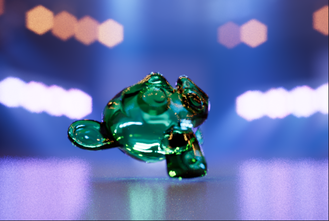
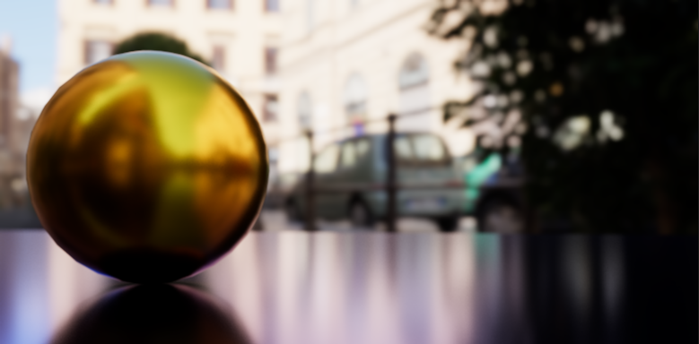
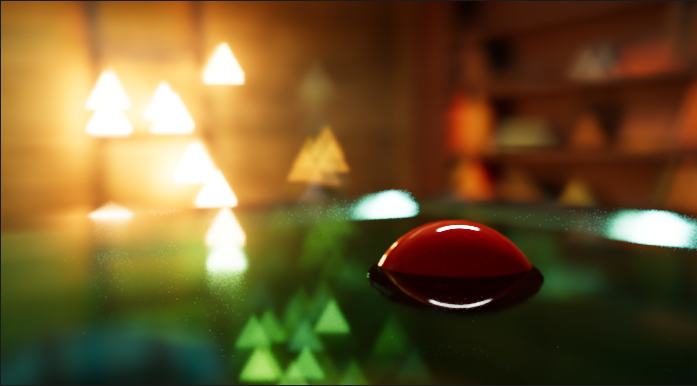

Tracy
===
A path tracer made in rust using compute shaders.

Features
---
- Unidirectional
- BVH with visualization
- Disney BRDF
- Image based lighting
- Multiple importance sampling
- Wavefront OBJ format supported

Requirements
---
- Vulkan/DX12 support, with limited support for older graphics APIs.

Build Instructions
---
Use rust's [cargo](https://doc.rust-lang.org/cargo/commands/cargo-build.html) to build project into an executable. Alternatively, download the release binaries in this repository.

Controls
---
- F1 will toggle the UI on/off.
- You can control the camera by holding down the left mouse button over the scene; this will activate camera input.
While the button is held: dragging the mouse will rotate the camera; WASD + QE will move the camera.

Screenshots
---

Editor

Todo
---
- Add support for textured rendering (albedo, roughnes, etc.)
- Separate UI thread from render thread. Would require interfacing directly with graphics library
instead of through rust-wgpu as that library forces each queue submit to wait for previous submits.
This is problematic because eframe (the UI framework used) also uses wgpu to submit it's drawcalls
which will block until the path tracer has finished its rendering.

References
---
- PBRT-v3 (https://github.com/mmp/pbrt-v3)
- Ray Tracing in One Weekend (https://github.com/petershirley/raytracinginoneweekend)
